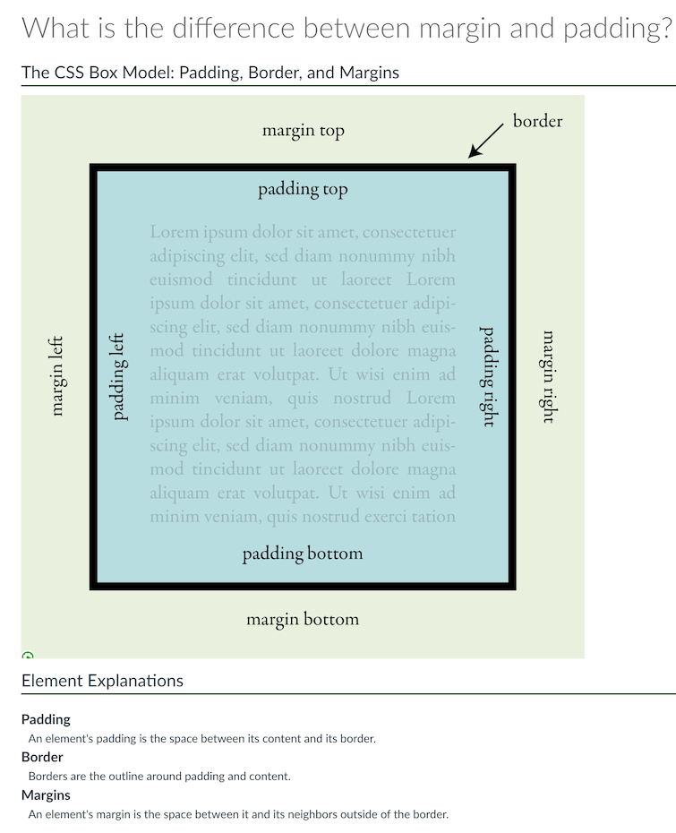

# Non-Course Projects

## Faculty Communications Manual

I have set up a GitHub repository to work on the faculty communications documents I have been creating for the course development manual. I would like to keep them private for now, but share it with you. To do this, I hope to add you as a collaborator. If you don't yet have one would you be willing to [Sign up for a GitHub account](https://docs.github.com/en/get-started/signing-up-for-github/signing-up-for-a-new-github-account)? That way I could share links and you could suggest edits. New or updated this week:

- [Formatting Issues with Pasted Content in Canvas](https://github.com/mundorfd/faculty-comms/blob/main/Formatting%20Issues%20with%20Pasted%20Content%20in%20Canvas.md) Request from Dana
- [Alt Text](https://github.com/mundorfd/blob/main/Alt%20Text.md)
- [Embedding Slides and PDFs into Canvas](https://github.com/mundorfd/blob/main/Embedding%20Slides%20and%20PDFs%20into%20Canvas.md)
- [Lecture Recording Guidance](https://github.com/mundorfd/blob/725418fec5e2724e8cfaae91f0e59b8baea86c93/Lecture%20Recording%20Guidance.md)
- [Late DOC Assignment Email](https://github.com/mundorfd/blob/725418fec5e2724e8cfaae91f0e59b8baea86c93/Late%20DOC%20Assignment%20Email.md)
- [Why Add an Assignment Purpose](https://github.com/mundorfd/blob/725418fec5e2724e8cfaae91f0e59b8baea86c93/Why%20Add%20an%20Assignment%20Purpose.md)
- [MLOs and Blooms Taxonomy Levels](https://github.com/mundorfd/blob/725418fec5e2724e8cfaae91f0e59b8baea86c93/MLOs%20and%20Blooms%20Taxonomy%20Levels.md)
- [Media Strategy Confirmation](https://github.com/mundorfd/blob/725418fec5e2724e8cfaae91f0e59b8baea86c93/Media%20Strategy%20Confirmation.md)
- [Permalinks Persistent Links](https://github.com/mundorfd/blob/725418fec5e2724e8cfaae91f0e59b8baea86c93/Permalinks%20Persistent%20Links.md)
- [Permalinks Persistent Links](https://github.com/mundorfd/blob/725418fec5e2724e8cfaae91f0e59b8baea86c93/Permalinks%20Persistent%20Links.md)
- [Using Images in Courses](https://github.com/mundorfd/blob/725418fec5e2724e8cfaae91f0e59b8baea86c93/Using%20Images%20in%20Courses.md)

## Internship Program

- AHE program coordinator has sent me four applications to review. I will do this and schedule them for our placeholder slots later this week.

## OLC Conference

- Prepped for Ecampus workshop, had to cancel Phil was sick.
- Developed an illustration and page for our course FAQ section

## Onboarding New IDs

- I am awaiting feedback on the updated onboarding plan and skills assessment survey

## Sr. ID Responsibilities

## Other

# Course Development Projects

## F23

### CEM 471

- Keeping progress in a [Course Development Tracking List](https://oregonstate.box.com/s/qxvp2ike0yiajqp5hv2b1rir2sxybwha "https://oregonstate.box.com/s/qxvp2ike0yiajqp5hv2b1rir2sxybwha"). I have completed the Overview pages for the whole course, and the Assignments and [Quizzes](https://canvas.oregonstate.edu/courses/1953777/quizzes "https://canvas.oregonstate.edu/courses/1953777/quizzes") have been built. I have built the Learning Materials for the media that has been processed (weeks 1–4 as of last week). I am still waiting on several videos for the later weeks.
- One video was missed - worked with Tenley to get it added to the video team processing queue. She was great about it!

### CS 162H

- Wrap up meeting is scheduled this week

### SCLM 450/550

- Rohan canceled on me this week. Several things were completed for him, captured in this [Asana task](https://app.asana.com/0/1204222537805703/1205472616144712). Specifically:
	- shared information on slash courses, since he had the same assessments for grad students as for undergrads
	- converted remaining slide decks to new template
	- shared guidance on the instructor information policy
	- shared guidance on a welcome message for home page
	- setup all discussions for the course (2x a week), with reminders for two follow ups to each (in progress w/help from student worker)
	- reworded week to module throughout site (in progress w/help from student worker)
	- build a discussion rubric
	- requested a meeting for this week or next

## W24

### AEC 250

- No activity this week. Penny canceled a meeting scheduled 2023-09-12. She is meeting with President Murthy at that time. Will reconnect first week of Fall term.

### CCE 207

- Joe has the 10 week course outlined and is working on video recordings. Content has not yet been delivered to me.

### CH 332

- Built Module 3, Module 1 overview and homepage banner
- Check in meeting with Kate and Jeff
- He requested porting existing content form spring course to studio site
- gave info on transfer of ownership for existing

Some back and forth with the media team. They had sent an email to Jeff that neither Kate or I were cc'd on. He is on the waiting list and [CH 332 - W24 - Video - Asana Task](https://app.asana.com/0/1123253820104403/1205280025484220)they had told him in that email:

> Please message me back with your availability for recording and I will reach out to Media Hub on your behalf to coordinate scheduling with them. Once we know your availability through the Fall for recording on campus, we can get the ball rolling.

I responded

> Jeff is at the Cascades campus and will be recording using the Lightboard there (which he helped set up and secure funding for). The media hub in Corvallis doesn't make sense.

Media team understands now, that this is going to be recorded in the Cascades. I have asked them to clarify with Jeff, since that initial correspondence was confusing.

### CS 493

- Check-in scheduled Friday. No activity this week.

### CEM 372

- Reached out to Amalesh to request a meeting. Haven't heard back yet (may still be in India)

### NSE 515

- Worked on build of module 7 from DOC and prepped for check-in meeting
- Camille has delivered three weeks of content

# LKAD
