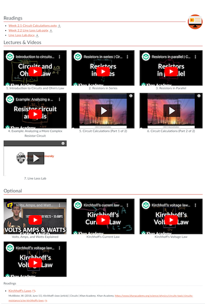
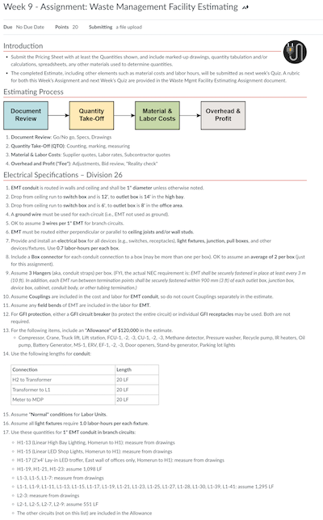
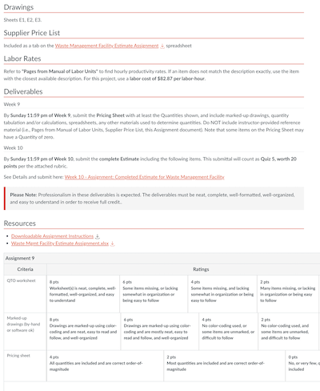
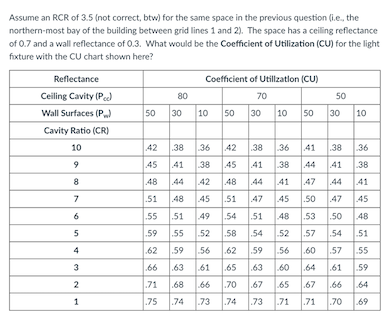
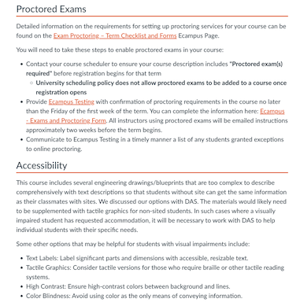

# 2023-09-22 Status Update

## Non-Course Projects

### IDKB

- Wrote [Word Doc Missing Table Headers – IDKB 🦫](https://idkb.oregonstate.education/knowledge-base/word-doc-missing-table-headers/)

### Internship Program

- Finalized Internship Placement Projects with ADs

## Course Development Projects

### F23

#### CEM 471

- I implemented feedback modules 1–6 and accessibility corrections in week 7 lectures.
- Finished all the learning materials pages, they were dense, see the example:

 

- Built staged assignment weeks 9 & 10

|                           |                             |
| ------------------------- | --------------------------- |
|  |  |

- Worked on Quiz 4. Needed to recreate the table in question so that it wasn't an image:

 

- Built staged assignments for weeks 9 & 10 and built visual
- Embedded remaining quizzes and assignments
- Built Home Page
- Completed course accessibility work
- wrap up work, overview pages
- Transferred course into Banner site
- Configured Assignment Groups
- Set Due Dates on Assignments
- Course site walk-through with instructor
- Added Instructor Info page with new sections on proctoring and accessibility exceptions

 

- Updated Start Here with accessibility options for blueprints and
- Reviewed and uploaded Syllabus
- Built Q & A Discussion as a Homework Helper location
- Ran link checks
- Backed up course to course folder
- Marked 100% in Salesforce

#### CS 162H

- Ran accessibility checks and made updates

#### SCLM 450/550

- Created a home page banner for the course.
- Constructed Modules 5–8
- Updated all discussions in the course. Add discussion initial post/reply post calendar reminders (as needed)
- Embedded Lecture Slides
- Added a Padlet activity to the course. Wrote student-facing instructions on using Padlet.
- During the final walkthrough, before the term started, significant content revisions were made, including adding a staged group project and rethinking graduate-level requirements.
- Created and added a group case study rubric to Modules 2, 6, and 8.
- Updated the communication policy from the course syllabus.
- Course site walk-through with instructor
- Built a newly submitted Final Project and a new Contracting Assignment. Had to update the content (grammatical corrections, alignment with Graduate CLOs)—and requested evaluation criteria for the Final Project and Contracting Assignment.
- Reviewed and uploaded Syllabus

### W24

### CCE 207

- Reviewed progress with Joe. He has the media underway and has outlined the course. We are meeting shortly after the start of the fall term to review and update content delivery deadlines and make sure he can meet the recording deadlines.

#### CS 493

- Reviewed Lecture Slides

#### No Activity This Week

- AEC 250
- CH 332
- CEM 372
- NSE 515

### MISC

- Created a markdown checklist to monitor progress on Ecampus Essentials.
- Spring 24 Intake Prep Work

## LKAD
