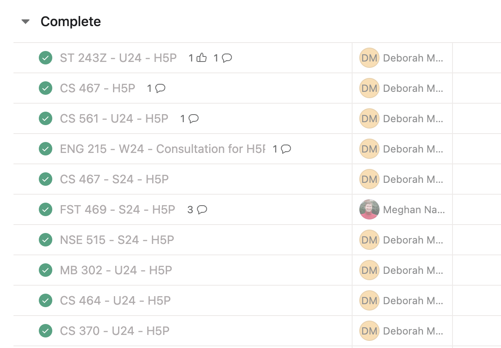

# Status

A few general comments. I have quite a bit of building I can do with recently delivered Spring content. I am hoping to be able to focus primarily on this until the end of this term. 

## Course Development Projects

### S24

#### AEC 250

- Embedded all lectures, finished learning materials pages

#### BDS 599

- Andrew has completed the delivery of most of his content. 

#### CS 201

- Brian has no updates this week. Cancelled the meeting and asked for an update on Friday. His response:

  > Sure thing. And I’m sorry about being so far behind schedule. If I lived in Corvallis, I would owe you Starbucks with a little sticker that says from your least favorite faculty member. 😬

- Scheduled a makeup meeting for Tuesday, March 5, 2024

#### SOC 280

- Check-in meeting
	- Lori has completed modules 1–6 for me to build, along with one writing assignment for later in the course
	- She has only done 10% of her recordings.
	- She is targeting 3/13 to complete content and recordings
	- She is aware that she may lose editing/captioning services. Jana asked me who/how decisions are made on whether she should be given an extension
- Spoke with Jana (Brad and Laurie) about whether or not to offer an extension on recordings. (Waiting to hear back on this.)

#### NSE 515

- Very much need build time for this one. I am behind.

### U24

#### CS 290

- Check-in meeting
- Nauman has completed one module
- Shared information on Affordability Matters Badge, which he submitted an application for

#### CS 332

- Very much need build time for this one. I am behind.

#### CS 372

- Dana and I started building Samina's activities in H5P. We had an evening work session doing this, because some of her questions didn't convert easily to H5P. She also is using complex LaTex. I installed the correct library in her H5P site to use this, and then shared with Dana how we could add LaText to activities. Process is a bit clunky. Samina is also using some LaTex that H5P does not support, did a little research on this.
- Created three different options for her question types for her to review
	- Presentation
	- Standalone
	- Interactive Book
- Met with Samina and shared our H5P samples and challenges. She will make some minor changes to the questions to more easily translate. She gave feedback on the H5P activity types she would like us to use.
- Created a student worker task to modify the H5P tasks from the previous course development. They all had the toolbar showing, and Samina wants to reuse them without this.

#### CS 464

- no activity on this course

#### CS 561

- Studio site set up for Chris
- Graded Week 6 final project, added to course studio shell. Discussed media recording issues with Noah.
- Discussed library guides, and added Chris to a demo site with the citation guide.

#### MAST 201

- no content at this point

#### NMC 3xx

- no content at this point

## Non-Course Projects

### AA FF Workshop

- I had a meeting with Cub, and he and I created a workshop agenda and session description.
- I drafted email to leadership about our suggested description/agenda.
- Started a collection of papers to refer to when creating workshop

### AI Concept Paper

- Drafted [AI-Driven Visualization & Multimedia Enhancement in Course Design](https://docs.google.com/document/d/1YxgcDAzicKYTU5_tiSWOJAXkhfPKaGDH-Mo-gLOmvRs/edit?usp=sharing) and shared with leadership.
- Updated based on feedback received.

### QCATE Taskforce

### Faculty Communications Manual

New or updated this week:

### H5P Admin

- Created H5P site for [ST 243Z](https://app.asana.com/0/1204959674312037/1206717629002419)
I have had quite a few of these assigned recently. I checked with Akira to see if she was still splitting them between Meghan and I. She said yes, but I had been assigned 9 of the last 10 tickets when I sorted by completion date. They don't take too long, but I'm hoping they are split every other going forward. Sounds like she will.

- H5P Admin request for CH 123
- H5P Admin support for CS 561
- Created an H5P site for [ST 243Z](https://app.asana.com/0/1204959674312037/1206717629002419) (and clarified naming for Z courses)

### IDKB

### Internship Program

- Coordinated with Becky Crandall on deadline for Spring internship applications
- scheduled tentative interview blocks
- Julie was sick this week. We hope to connect Tuesday, March 5, 2024

### Onboarding New IDs

- Met with Laura Collins to explain the asana project and scheduling requirements
- Working with Victor on scope, quantity, and attendees for media-related onboarding meetings. Asked EJ to do the Studio Tour (he said sure!)
- Scheduling coordination with various team members, updates to the asana project with some new identified tasks and information
- Onboarding meeting with Haley - contacted Doug about Salesforce access, added her to ecampus template, showed her how to request a studio site
- Check in with FSHAO to make sure they were reaching out

### QM Pre-Review

- Completed my QM Pre-Review of GEOG 380. I plan to reach out to the instructor this week, schedule time with him once I return from vacation.

### Sr. ID Responsibilities

### Other

- DOC Week 6 Facilitation[DOC Week 6 Facilitation](https://canvas.oregonstate.edu/groups/583390/discussion_topics/10565881)
	- Themes: Flexibility for Ecampus Students
	- Appointment Scheduling
	- Length reply to one instructor with a long turnaround time and a bit of an inflexible communication policy. Shared with Ashlee.
- Shared Adobe CC Libraries I have created with Media Team
- Customized Template Buttons for Kate
- submitted purchase request for replacement laptop

%%add LKAD tag when ready to submit%%
