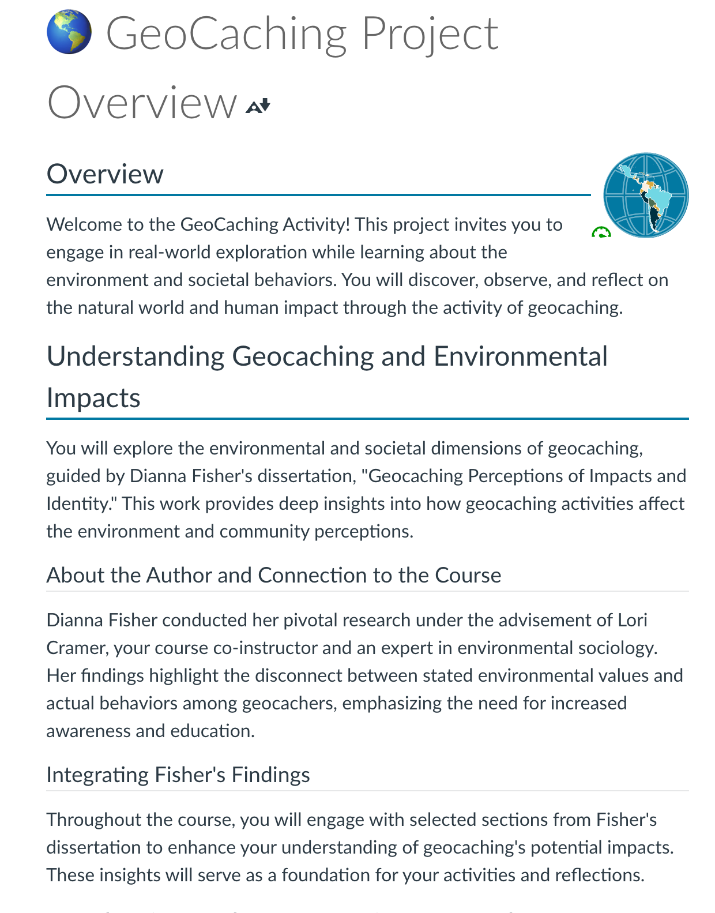
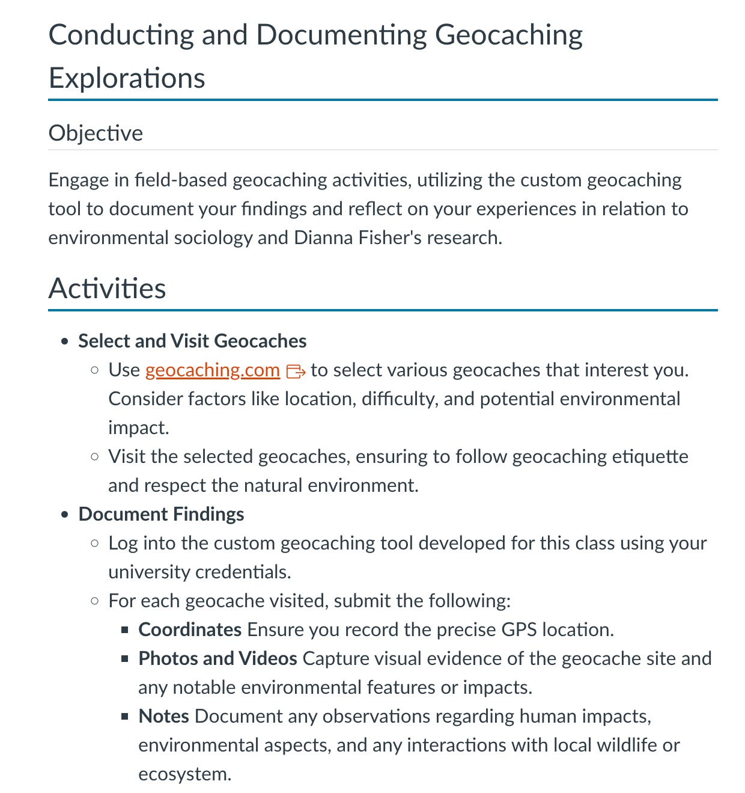
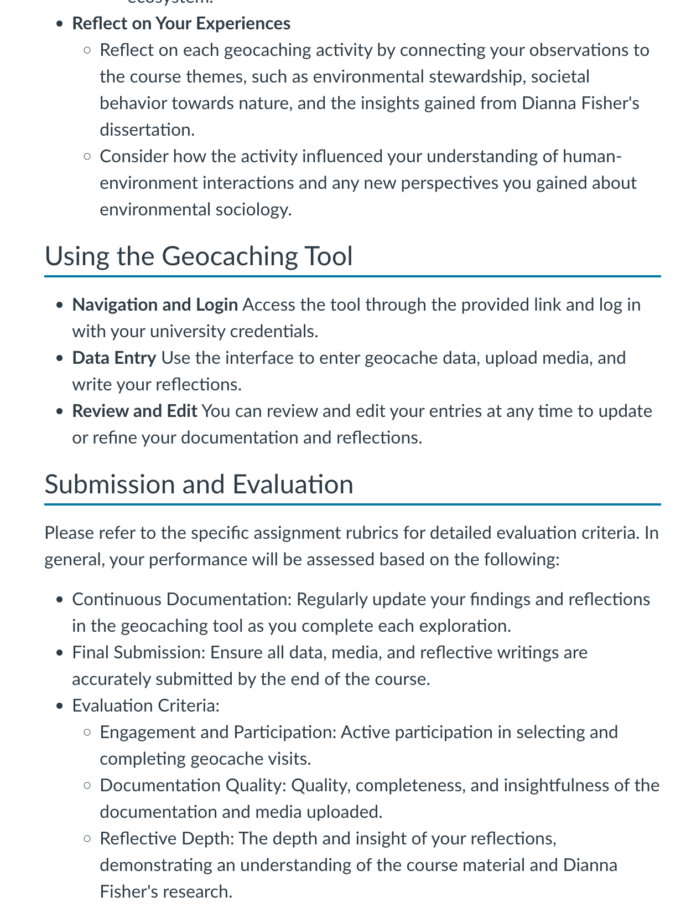
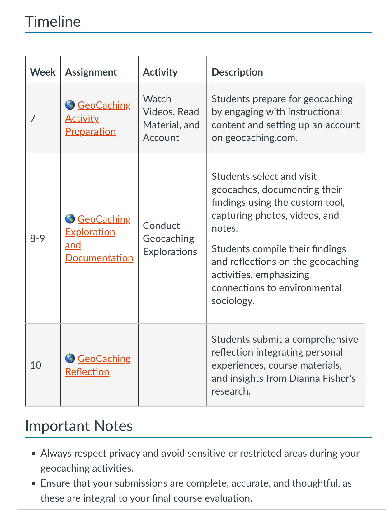

# Status

## Course Development Projects

### W24

#### ME 383

- Held a debrief with Matt Campbell about how this course went. Group labs went well. Discussed a few Academic Integrity concerns (thinks students are working together on Homework in Discord). He may use a proctored final exam in the future, since he is uncomfortable with the large window it needs to be open.

### S24

#### BDS 599

- Met with Andrew to discuss several things about the course.
- Perusall activities are working well, but he didn't know how to return the grades to Canvas. After writing it up, I shared that with him.
- Since Andrew is worried about students dropping out and perhaps that the course has too much content, I suggested Andrew add a survey to check with the remaining students. I shared with Andrew two research-backed practices regarding student surveys (which he asked for):
	- Samuel, A., & Conceição, S. C. O. (2022). Using the Critical Incident Questionnaire as a Formative Evaluation Tool to Inform Online Course Design: A Qualitative Study. International Review of Research in Open and Distance Learning, 23(2), 151--169. <https://doi.org/10.19173/irrodl.v23i2.5959>
	- <https://ocw.mit.edu/courses/5-95j-teaching-college-level-science-and-engineering-fall-2015/resources/active-learning-strategy-mud-cards/>
- He was convinced, so I built and added a [midterm survey](https://canvas.oregonstate.edu/courses/1970784/assignments/9669267?module_item_id=24401199) with questions Andrew developed to get student feedback on course workload and material.

##### New BDS 599 To-dos for Deb

- There are still a couple of things he wants to redo in the current course (adding a discussion to week 6, modifying a week 10 discussion to an assignment)
- There are a handful more he wants to make to a studio site for next time.

#### CS 201

- All the activity is documented in [a shared CS 201 Feedback document](https://oregonstate.box.com/s/qb7lyf3ot0yg014w7p5rfy16xh3qelj3). There is module by module feedback. Details below
- I have requested a meeting to wrap up our collaboration, but have not heard back.

##### My Activity

- **Home Page**
	- Reviewed and suggested adding an instructor intro video and a personalized welcome message.
	- Provided guidance on writing a welcome message.
	- Suggested applying for the Affordability Matters Badge.
- **Start Here**
	- Updated content with CLOs and instructor information.
	- Recommended filling out contact information, office hours, expected response times, and grading turnaround times.
	- Advised creating a syllabus using the latest Ecampus template.
	- Updated outdated information on where to go for help.
- **Academic Integrity**
	- Added content on Academic Integrity and suggested incorporating reminders in assignments.
- **Weekly Overviews**
	- Updated links, banners, and content for each week's overview.
	- Reviewed and suggested updates for explorations, demos, reviews, and assignments.
	- Noted accessibility improvements made to tables and content.
	- Highlighted areas with missing or outdated information that need attention.
- **Miscellaneous**
	- Identified and corrected accessibility issues related to adjacent links and structural problems.

##### Brian Needs to Complete

- Add an instructor intro video or write a personalized welcome message.
- Apply for the Affordability Matters Badge.
- Fill out contact information, office hours, expected response times, and grading turnaround times.
- Create a syllabus using the latest Ecampus template.
 - Update information on where to go for help.
- Incorporate reminders about academic integrity in assignments.
- Replacing vocareum placeholders and some Repl.it activities in explorations
- Updating some videos
- Determine how non-graded discussions should be addressed (there are references to Ed Discussions, and Canvas, some CS courses are using Teams now.)

#### CS 493

- Nauman asked for updates to his Qualtrics Mud card surveys. He wanted to see the survey responses in Speedgrader and the grade synchronization settings.

#### SOC 280

- I completed building her final staged project the one that uses the custom media in the second half of the course. I developed a significant amount of the text, assignment design, and rubric criteria for this one. Pretty proud of how it turned out and Lori is very happy: Here is an overview and listing and link to all the related assignments [🌎 GeoCaching Project Overview: INTRO TO ENVIRONMENT & SOCIETY (SOC_280_400_S2024)](https://canvas.oregonstate.edu/courses/1981351/pages/geocaching-project-overview?module_item_id=24390585)

|  |  |  |  |
|:---------------------------:|:---------------------------:|:---------------------------:|:---------------------------:|

- The remaining tasks on this course are not building, admin stuff like backup, essentials, etc

#### AEC 250 & NSE 515

No updates to status from last week

### U24

#### CS 290

- Nauman is looking for a solution for language-aware syntax highlighting* in Canvas. I told him I didn't think this could be done, or at least not easily. I could only conceive of doing this if someone who knew the language being taught in the code very well went through each line and manually styled the text.
	- *_Language-aware syntax highlighting uses colors to differentiate the various parts of code, like commands, variables, and comments. This makes it easier to read the code, spot mistakes, and understand what each part does. "Language-aware" means that the syntax highlighting knows the rules and structure of the specific programming language and applies the correct color coding based on the specific grammar of the programming language you're writing in, whether that's Python, JavaScript, or any other language._
- But I found a solution! And then tested accessibility. (Dana helped) I have written it up in [an explainer document](https://github.com/mundorfd/lkad/blob/main/Code%20Highlight%20Tool.md) for you to see. I also shared the strategy with Chris H, who discussed the same issue with me.

#### CS 332

- Amy has finished adding content to her course site for all ten modules. I will review anything I haven't seen and implement and compile feedback before a meeting with her on Wednesday, April 24.

#### CS 372

- Met with Dana to assign tasks
- I built nine H5P Activities embedded in the course
- Reviewed updates with Samina
- Samina is working on lecture recordings for the 4/26 deadline. She has built the first three modules (but no recordings)

#### CS 561

#### MAST 201

- While Lori hasn't delivered the modules to me yet, much of the course is laid out in [a document she is working on](https://oregonstate.box.com/s/1i21q3ulskzmdo3ccxjxvrrztpjcpmqq). She has documented the planned learning materials for the whole course, along with an idea of what activities she plans to have students do each week. (thus the 15% progress)
- We will now meet weekly, trying to stay on top of this and MAST 300; she has a lot on her plate.

#### NMC 3xx

- Had a custom media meeting with Alina and the web team
- Took several notes about what Alina needs to provide the team
- Meeting with Alina Tuesday, April 23 to try to help her get started on content.

### F24

#### CE 382

- I haven't found the Course Learning Outcomes in CIM. I saved the ones Minje used in the DOC Course Planning Chart assignment and asked for an existing syllabus.
- Graded week 1 planning chart from DOC

#### CEM 341

- Joe delivered the first three modules, minus recordings, late in the week. Build not started.

#### CS 161

- Reviewed an assignment Tim has developed that he wondered if it was too complex. Shared several scaffolding things he could do (supplemental content and staged assignments for the skills necessary)
- I tested several LaTex methods in Markdown conversion to HTML so that a screen reader could read the equations. Recorded on Loom (just to give it a try) so Tim could hear it being read: [Loom Message - 15 April 2024](https://www.loom.com/share/8f1acf462a564647a68183f5e5e1f7f7?sid=7577c00c-cec6-4931-a4a4-13f0d02f5bdf). Also tested rendering in GitHub, since this is how assignments are delivered for this course. Included recommendations for supplemental alt text
- I spoke to Tim about the studio site shared ownership. He has been working in his own site. He made me a leader and I added you and ecampus gmail address. He was hesitant to move to a new site, but this should accomplish the same permissions. It will be easier to insist at the beginning of a development in the future.

#### ENGR 103

- I checked in with Doshna about her expected timeline. She says she will be doing her changes during the summer term; then at the end of summer, will import Tim's updates. I will get back in touch with her at the start of Summer term.

#### MAST 300

- Early design discussions only. She has an idea for a staged assignment, most of her content work is now (out of necessity) on the MAST 201 course.

#### Future

- CS 431: Ami Gates wrote me and wants to get started developing CS 432. I see a proposal but no course design record. Can you please let me know what I should do with this request?

## Non-Course Projects

### AA FF Workshop

- Cub and I have set up a working meeting for Tuesday, April 23. Right now, we have a detailed outline, but we need to plan slides and facilitator tasks.

### UQATE Taskforce

- Planned and facilitated the biweekly meeting.
- In preparation, I documented a test flow for an existing tool as a case study
- Akira pulled several projects we could look at that historically that might have lessons learned.
- Nick and Tiana worked on a QA testing scope document
- Elisabeth updated and shared UX testing scope

### Micron

- Karen emailed today (April 22, 2024) and said that I need to help respond to the Micron proposal and, presumably, am going to be tapped for building the course. She wants this to Shannon/Jessica by the end of this week.

### Other

- Chris L sent out a request to Ashlee and I to review the findings of the ID Design Library inventory that Julie conducted. It has led to a desire for a better definition of what each resource (IDBK, LADR, IDDL). He sent out a list of IDDL content and suggested new repots, which I reviewed and returned feedback on. He wants to meet as a group, but this will happen in May.
- Took notes in ID2ID meeting, provided feedback shared by IDs with me about the meeting discussion.
