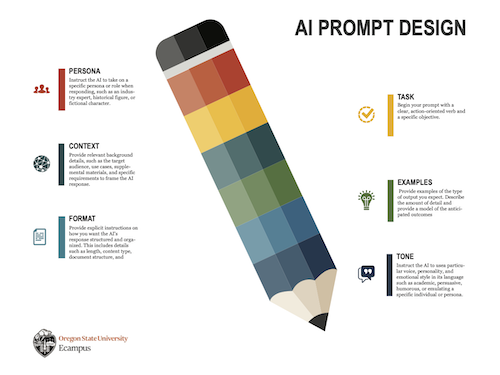
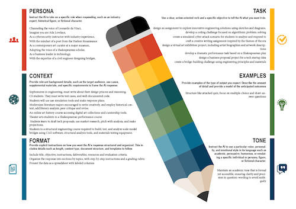

# Status

## Course Development Projects

### S24

#### AEC 250

- Scheduled a catch-up meeting for May 16, 2024

#### CS 201

- Brian asked to cancel the Friday, May 10, 2024, meeting they didn't have enough done. I responded that I needed an update and then to offer times this week to reschedule. I haven't heard back. I cc'd you on the most recent reply (Monday) and an escalation step.

#### NSE 515

- As of Friday evening, I had redesigned and reviewed the already in-place content through week 7. (It's Monday, and I have now updated the remaining modules.
- Ongoing PDF accessibility work, 11 PDFs have been replaced with files with accessibility updates.

### U24

#### CS 332

- Reviewed the first module in Canvas with Ami.

#### NMC 333

- I met with Alina, and she's made great progress, overview content for every module and learning materials almost all selected. Assessments next and assignments for the custom app
- Reviewed literature on [Online Dating and Romance](https://www.researchrabbitapp.com/collection/public/R6DP8NN26P) and created a collection to collaborate with Alina. Looking in particular about for topics around experiences of specific populations (with disabilities, minorities), impact on mental health, and the qualification requirements and use of dating coaches.

No updates: CS 290, CS 372, CS 464, MAST 201, MB 302

### F24

#### CEM 341

- Updated Joe initial design activities and introduced a Haley.
- Reviewed and clarified the Week 2 and 3 content with Haley so she could continue building
- Imported an old course backup to a studio site so Haley could see how question groups, quiz structure, and other question types were built in Joe's previous courses.

#### MAST 300

- Discussed production plans for course videos

#### CS 561

- Documented and discussed H5P integration options for graded and non-graded activities​. Chris wants graded activities, need to create a request.
- Designed icons Chris requested for Knowledge Checks and and Exercises.

No updates: CS 161, CE 382

## Non-Course Projects

### AA FF Workshop

- Created template, graphics, and instructional content and revised based on feedback the [2024 Faculty Forum AI Workshop - Google Slides](https://docs.google.com/presentation/d/12ZlTcwq1eas2IB_s4YV75FDacw_3DoAqoXL_BID3k9w/edit#slide=id.g2cf296ee031_0_15) for the AI Workshop
- Fixed formatting issues in the AI FF Workshop slides
- Delivered with Cub and IDs FF Workshop
- Contributed to [FF '24 AI Workshop - Tabletop Feedback - Google Jamboard](https://jamboard.google.com/d/1JN_KFcUCYUknWxiNQfju6VnkGCDwrjmmEEGMvficWhM/viewer)
- Created several resources for participants in our [Participants Folder](https://drive.google.com/drive/folders/1ywxmAuJFGGdo5MkQ2rakoNqfrx72fvLL?usp=drive_link)
- Created AI Prompt Design Infographic

| | |
| ------------------------ | ------------------------ |

### QM Pre-Review

- Heard back from Peder regarding the Quality Matters pre-review for GEOG 380, identified with him some next tasks.
