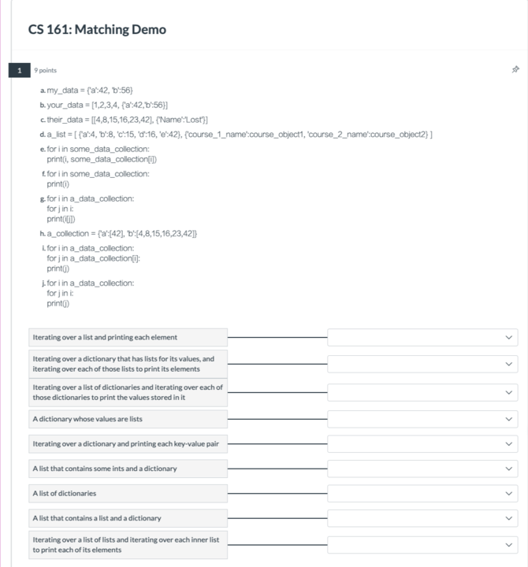
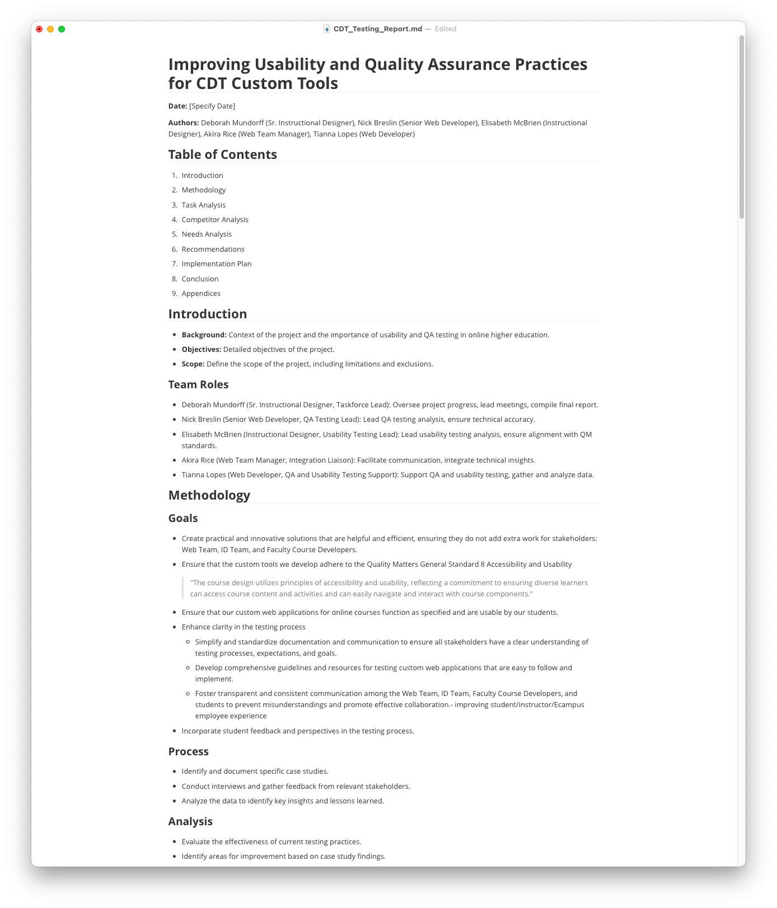

# Status

## Course Development Projects

### S24

#### AEC 250

- I had a catch-up meeting with Penny to clarify what I was still waiting for and any updates she had.
- Got access to the site to transfer the material to, so I can setup Gradescope and transfer her content
- Penny still needs to review the homework files before I can setup Gradescope, she is having a graduate student do this.
- Penny needs to write the exams as well
- We are meeting again on Wednesday, May 29, 2024, with her and her graduate student. I have asked that she have everything done by then, she seemed to think that was doable. (offered summer term)

#### CS 201

- All modules, the syllabus, and the Start are done.
- He still needs to record several demo videos.

#### SOC 280

- Submitted Ecampus Essentials

#### NSE 515

- As of Monday, I had completed updating all of the modules.
- Had to send Camille one question about timeline assignment design (just heard back will finish that this week)
- Replaced PDFs with accessible files
- Ran final link check

### U24

#### CS 290

- Nauman is done with all the modules and assignments. He still has 40% of the videos to record. He was given a slight extension to complete these

#### CS 332

- No activity this week

#### CS 372

- I pushed Samina a bit for an eta on content completion; she said she plans to finish everything by June 04, 2024.
- She is finalizing the recordings for week's 4 & 5 with a goal to finish recording by 2024-05-23.
- Dana and I have divided up the next batch of H5P activities to build

#### MAST 201

- No updates on content completion
- Her goal is to move things into weekly spaces from the master course outline this week (fingers crossed)
- Her in-studio interviews were done, needs to follow up with interviewees if they have done background images and audio
- Coastal field trip interviews were done last Friday

#### NMC 333

- Alina has completed her overview pages and learning materials selection except one week (see below)
- I set up assignment templates for all weeks
- Alina was having trouble finding learning materials for one of her modules. She wanted academic or news stories about dating coaches.
- She was looking for critical analysis/information on dating coaches: unethical practices, manipulative or unethical techniques to attract clients, and exaggerated claims about their success rates. sexist and offensive advice, scams and fraud, lack of qualifications, exploitation of vulnerable populations. One of my dearest friends is an editor at Bloomberg News (we've known each other for about 30 years since we were college roommates). She’s also an instructor at Georgetown. I thought she might be able to locate some materials Alina and I couldn't for NMC 333, and I was right! Magan came through with several choices.

### F24

#### CE 382

- graded DOC assignments
- meeting with James and the instructors about animation

#### CEM 341

- Reviewed meeting schedule and reminded Joe of recording deadlines. He said he aims to be through week 5 by the end of this term.
- I met with Haley to review her findings from working on the slide decks and assignments for the first three modules. I also introduced her to Joe virtually. She will be invited to meetings going forward (but had a conflict for the next one). I also encouraged her to provide ID input on content and will ask her to help with some workload estimations he would like once the materials for the first few modules have all beendelivered.
- I curated several CE/CEM and one ME learning materials page for Joe. He was concerned about the quantity of lectures. His pages were in line with the examples I shared

#### CS 161

- Reviewed learning materials for modules 6 & 9. Completed two assignments as a test run.
- Cleaned up several pages with accessibility and layout issues
- Setup H5P site
- I tried to develop an activity for this course in H5P, but ran into limitations with colons in the answers. Setup a demo site with new quizzes and built-in that. Thanks for the idea!

#### ENGR 103

- will contact at the start of summer term

#### MAST 300

No content updates, she really needs to make progress on MAST 201.

### W25

#### CS 561

- Generated several ideas for Chris to review for the lab activity of poker planning. I sent a list of suggestions that included steps to do this with GitHub, Microsoft Teams, Google Sheets, and Qualtrics Survey.

## Non-Course Projects

### UQATE Taskforce

- I have set up a private GitHub repository for the team so that changes to the report I am compiling can be tracked with version control.
- Made an outline for our final report document: [Improving Usability and Quality Assurance Practices for CDT Custom Tools](https://oregonstate.box.com/s/hqc24gyzz6w4b1stkpgoiqpdy5augslq). Added information from artifacts the team has created so far
- reviewed all artifacts and added content to various sections of the first draft of the report
- Reviewed the first draft outline of the report thus far with the team

### Faculty Communications Manual

New or updated this week:

- [UDL Suggestions and Explanation](https://github.com/mundorfd/faculty-comms/blob/33aeb76ad3443a3bc1a321940469016fae8880db/UDL%20Suggestions%20and%20Explanation%20for%20Faculty.md)

### Onboarding New IDs

Katherine asked that Haley be allowed to shadow DOC discussion facilitation this week. I met with her.

- held a short meeting to talk about how I approach facilitation (frequency of posts, what I am looking for, how I approach my responses)

I shared with her my [Curated DOC Week 6 Discussion Feedback](https://github.com/mundorfd/faculty-comms/blob/33aeb76ad3443a3bc1a321940469016fae8880db/Curated%20DOC%20Week%206%20Discussion%20Feedback.md)

### Other

- DOC discussion facilitation
- Julie asked for some assets for an older color variation (Pine Stand). I updated them in Illustrator and added them to a new Box folder I am migrating assets to. (Running out of allotted Google Drive space)
- Watched Angelique's recorded presentation and provided feedback
