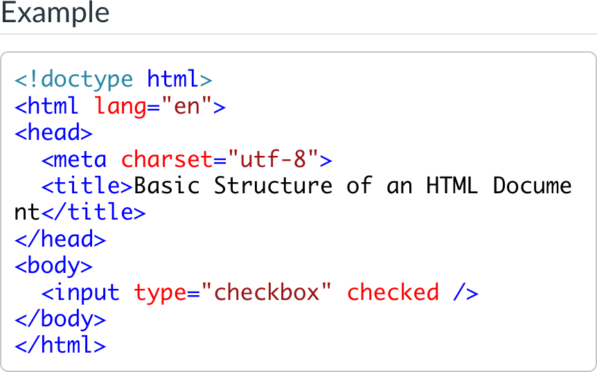

# Status

## Course Development Projects

### S24

#### AEC 250

- Built Start Here Overview page
- Built Assignment Template - for PDF fillable HW files. I have been waiting for the review of the built homework to add them to the course, and Penny had a grad student do this last week. I received them Friday and will make the changes. The changes required almost entirely extend to fixing errors and making updates to content delivered by the first graduate student who built the assignments.
- Added Homework Solutions Videos to the course site

#### CS 201

- Transferred course to Live site.
- Created three new banners.

### U24

#### CS 290

- Going through all pages to update inline code and code blocks to use updated syntax-aware styling.
	- 
- reviewing and cleaning up exploration pages in progress

#### CS 332

- no progress, need to work on this week!

#### CS 372

- Discussed with Dana, I have several H5Ps to build before our meeting this week

#### MAST 201

- Sent an urgent email to Lori to address delays in course development progress. The email highlighted the current status, outlined missed milestones, and provided action steps to get back on track. Emphasized the importance of timely content delivery and maintaining quality standards. Requested an estimated delivery schedule for remaining content and encouraged communication of any challenges.
- Inspired by the showcase at CDT, I reached out to Rick and Tenley about the field trip videos they shot last week to see if they had any "behind the scenes" photos I could include in the course site. Drafted and emailed the course instructor proposing incorporating behind-the-scenes (BTS) content into MAST 201. The proposal includes using BTS photos and videos from the Coast Interviews to create engaging "Field Trip" pages that provide context for each interview, detailed insights into the interview preparation process, and active learning discussions linked to course learning outcomes. Shared relevant BTS content and showcased presentation slides to illustrate the concept.
- Received an update from Lori on her progress and goals for MAST 201. She has:
	  - Almost completed draft of the weekly topics/outlines and started transferring learning materials to the weekly content folders
	  - Drafted material for Week 1 in the Weekly Content Folder.
	  - Updated the syllabus with learning outcomes/assessment table, grading criteria, and table of course content.
	  - Completed the recording of the last interviews.
- this is enough to at least let me get started setting up her shell site with module overviews, weekly topics. and perhaps getting some content into the learning materials pages

#### NMC 333

- Alina has completed design of her staged Dating app assignment, identifying requirements, activities, dating app experiment parameters.
- Reviewed the working model of the custom app with the web team. They have completed initial preparations for implementing the persona creation and interaction activities.

### F24

#### CE 382

- Met with Minje and Michael to discuss DOC work completion and plan for continuing development. We have been working on overcoming accessibility issues that come up with their use of LaTex in PDFs. I gave them a few options (none of which are perfect, but we can put all but their LaTex into an accessible file and then create image descriptions for the LaText). I agreed to test with their content and see if I could develop any additional solutions. Sample content provided at the end of the week, so will test it out this week.

#### CEM 341

- Joe started recording lectures, despite an earlier conversation that we needed to update his slides. I emailed him again, recommending important updates to their slide decks before proceeding with further recordings. The recommended updates include converting slides to a 16:9 format, removing content from the bottom for captioning, updating image sources, ensuring accessibility with alt text, and creating PDF copies for easier student access. Noted that Steve, the lecture media coordinator, is discussing with Haley the possibility of swapping new slides into existing recordings.
Haley has been working on his slides, so I met with her as well to discuss what we needed to do, how I was planning to respond to his starting recording early, and the plan for updating and reviewing the slide decks.

#### CS 161

- Template updates that Tim requested on several overview and home page
- Showed him the syntax-aware highlighting I am using in CS 290, he wants to use it too

#### ENGR 103

- will contact at the start of summer term

#### MAST 300

- No content updates, she really needs to make progress on MAST 201.

### W25

#### CS 561

- Chris completed filming his [course introduction video](https://app.frame.io/reviews/558c4d44-085e-427f-91b0-22d2d1014e01/f252e8a4-e5d5-4fe2-9990-d5d701416a64) with Drew. He asked me to review it, and is himself very happy with the results.

## Non-Course Projects

### H5P Admin

- Deployed one site for Heather's course

### Onboarding New IDs

- Intern Orientation meeting with Haley

### Other

- Attended AI Council 2.0 meeting
- Prepped for meeting by outlining topics I thought worth pursuing (Karen's prompts: what's exciting, what's scary)
	- Exciting
		- employees building and sharing GPTs to solve their own problems, automate work
		- creating educational content (explainer animations, visuals, alt text, infographics)
		- customized tutoring
	- Scary
		- harder to design assessments that AI can't do
		- Interference in democratic institutions by propagating fake information and content
