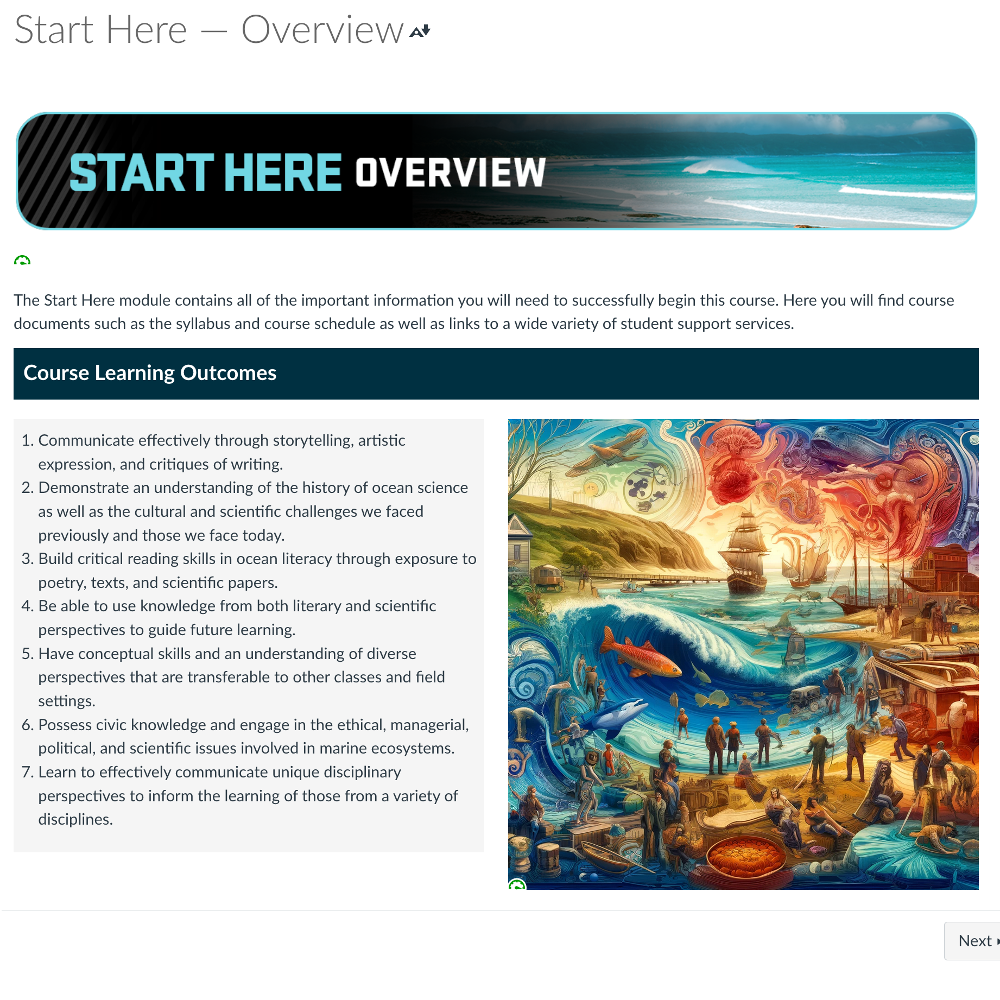
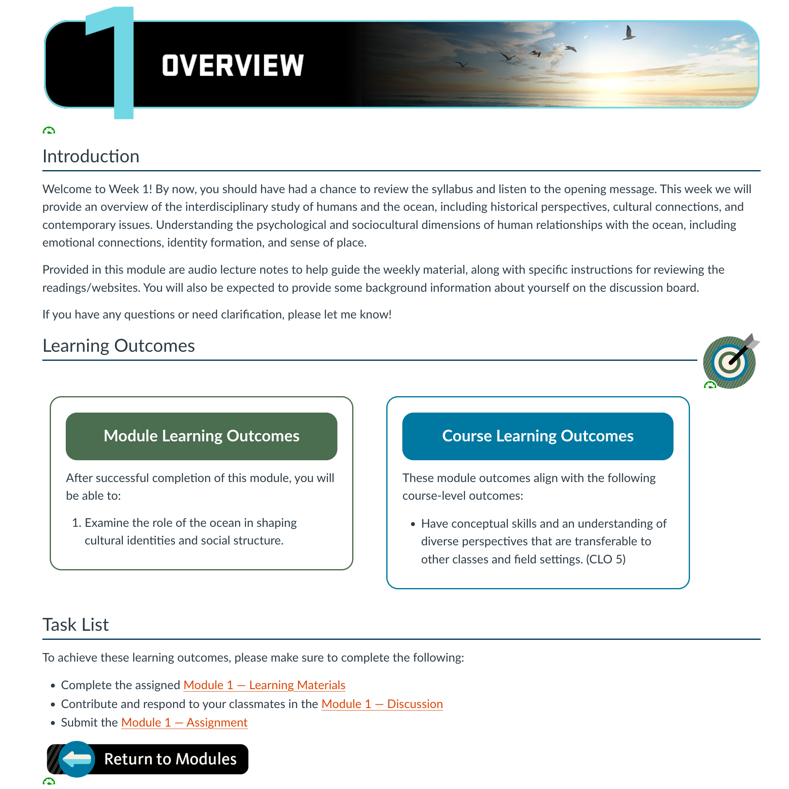
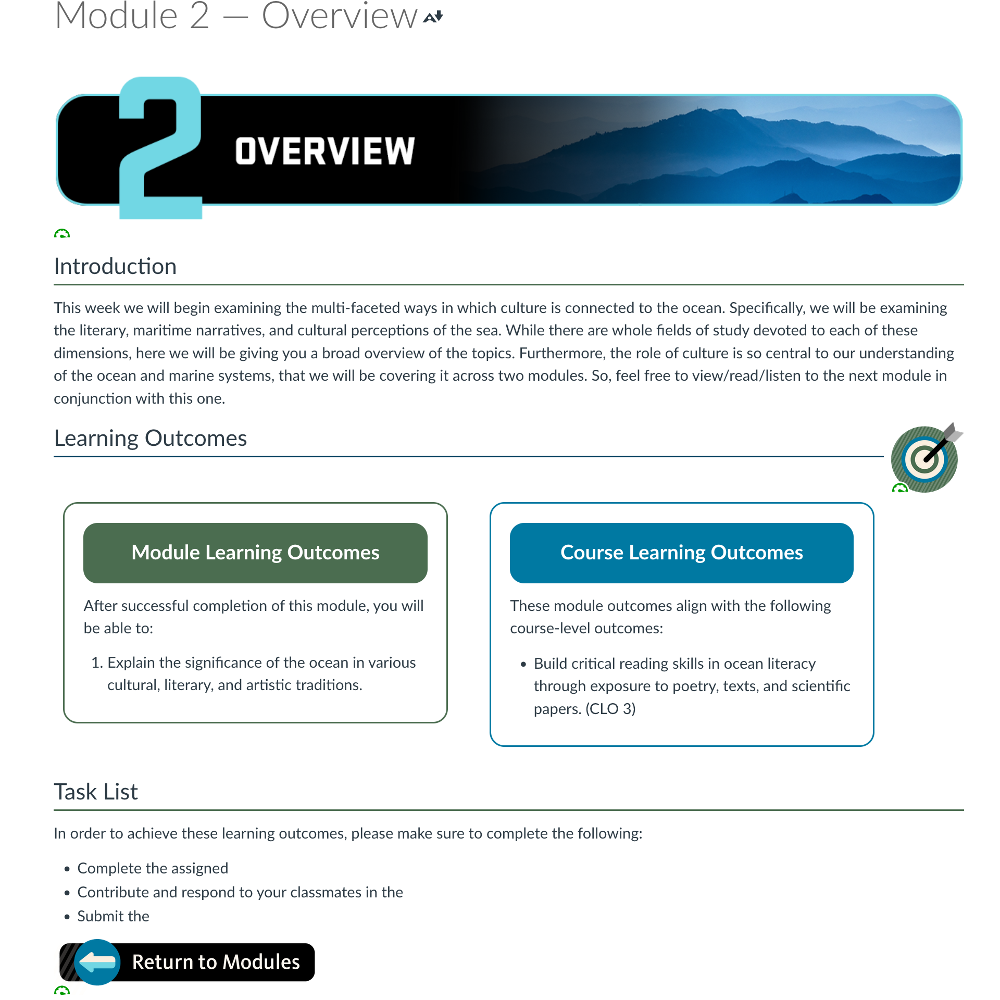
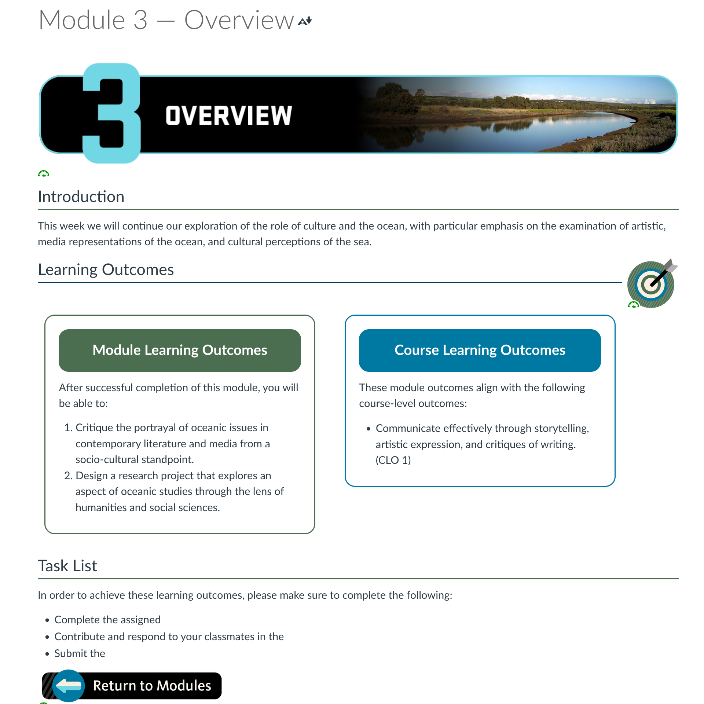

# Status

## Course Development Projects

### S24

#### AEC 250

- Long explanation to Penny about Quiz design. See email to Laurie 2024-06-05
- Wrote up Quiz Feedback
- Migrated course site and linked course with Gradescope
- Created a no-stakes practice activity for Gradescope
- Wrote [extensive student-facing instructions for the Gradescope Assignment submission](./images/gradescope.png). (screenshot too long but visible at link)
### U24

#### CS 290

- Built through Module 6, built rubrics, embedded media

#### CS 332

- No activity this week

#### CS 372

- No activity this week

#### MAST 201

- Last week Lori gave me the first three modules. Checking today, Tuesday, June 11, she has added three more. Since I had been waiting for her content, I started on some of the pieces I could largely template.
	- I built a template for the module overview pages, and then the overview pages for those first three modules:

|  |  |
| --------------------------------- | ---------------------------------- |
|||

#### NMC 333

- built modules 1-3. sourced some content, customized icons built two rubrics
- Built Assignment 4
- NMC Custom App meeting with testing and feedback

### F24

#### CE 382

- Tested.tex file, confirmed animation needs, confirmed 3-minute cap with instructors

#### CEM 341

- Redesigned slide deck for week 4
- Discussed lecture issues with Haley, who composed an email to Joe.

#### CS 161

- No activity this week

#### ENGR 103

- will contact at the start of summer term

#### MAST 300

- No content updates, emphasized that we were getting behind, but acknowledged the urgency of MAST 201.

## Non-Course Projects

### OLC Accelerate

- OLC Accelerate: proofread proposal and make suggestions, fill out bio and profile picture on OLC website

### Faculty Communications Manual

New or updated this week:

- [Choosing a Canvas Quiz Question Type](https://github.com/mundorfd/faculty-comms/blob/c773dacf53a54ab5ecd4d82c9fe330d0ec21aa1c/Choosing%20a%20Canvas%20Quiz%20Question%20Type.md)
- [Quiz Instructions Needed](https://github.com/mundorfd/faculty-comms/blob/c773dacf53a54ab5ecd4d82c9fe330d0ec21aa1c/Quiz%20Instructions%20Needed.md)
- [Using Canvas Essay Questions for Images and Text Answers](https://github.com/mundorfd/faculty-comms/blob/c773dacf53a54ab5ecd4d82c9fe330d0ec21aa1c/Using%20Canvas%20Essay%20Questions%20for%20Images%20and%20Text%20Answers.md)

### Other

- Updated [Canvas LMS HTML Code Output Tool](https://docs.oregonstate.education/lmstools/) with authentication script. It was not previously behind ONID authentication, and Nick gave me a script to add to all the tool pages which solves this problem.
- Helped Kate troubleshoot Illustrator and built her an Icon
